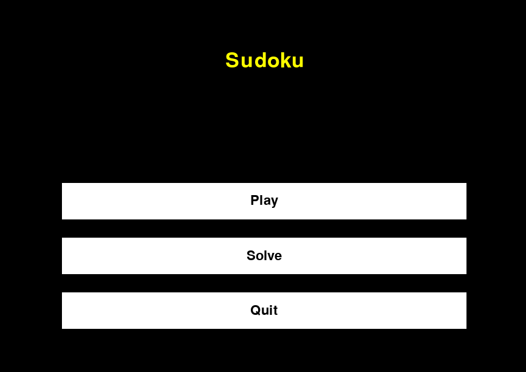
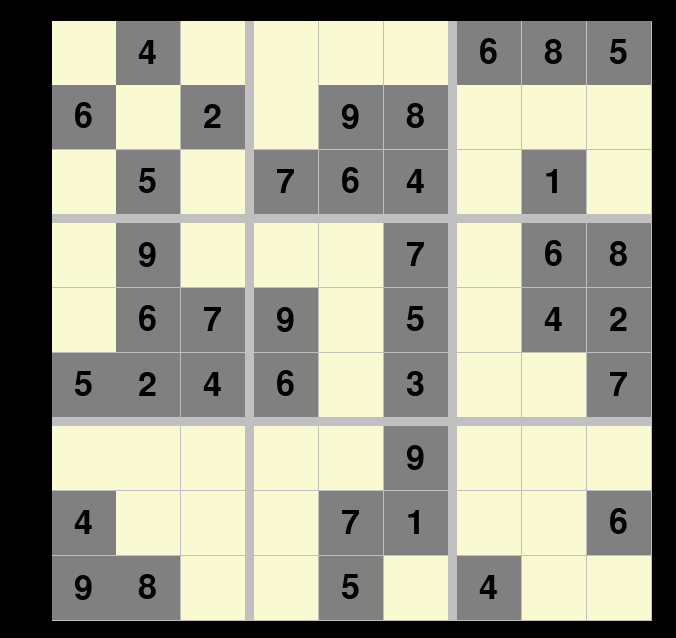
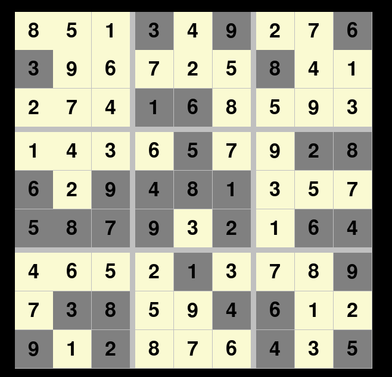

CONTENTS OF THIS FILE
---------------------

 * Introduction
 * Requirements
 * Maintainers
 * Screenshots

INTRODUCTION
------------

Sudoku game made in python using pygame. 
Main menu of this games allows user to choose, if he wants to 
solve the game, or he wants game solved.  
Player can even solve as much as he is able to, and then check
if his solution is correct, i.e. board is still solvable

REQUIREMENTS
------------

Pygame

MAINTAINERS
-----------

 * Marek Brandt

SCREENSHOTS
-----------

